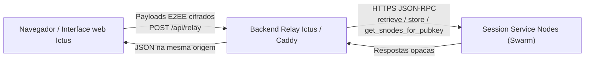

# Ictus Messenger

**Cliente web leve, auto-hospedável e zero-knowledge para a rede Session**

[](./LICENSE)
[](https://www.gnu.org/licenses/gpl-3.0)
[](https://nodejs.org/)
[](https://www.typescriptlang.org/)
[](https://react.dev/)
[](https://vite.dev/)
[](https://libsodium.gitbook.io/)
[](https://expressjs.com/)
[](https://www.docker.com/)

O Ictus Messenger é um cliente web independente, rápido e **auto-hospedável** (*self-hosted*) para a rede de mensagens descentralizada [Session](https://getsession.org/). Chaves criptográficas e o texto claro das mensagens **nunca saem do navegador**: a decifragem ocorre estritamente no cliente. O backend atua como um **relay cego** — termina TLS/CORS e encaminha JSON-RPC aos Service Nodes da Session, **sem reter histórico de conversas nem logs de acesso**.

---

## Isenção de responsabilidade

O Ictus Messenger é uma **iniciativa independente e de código aberto da comunidade**. **Não** possui afiliação, endosso ou vínculo oficial com a Session Technology Foundation, a Oxen ou os aplicativos oficiais Session para desktop/mobile. Session® e marcas relacionadas pertencem aos seus respectivos titulares. O uso é por sua conta e risco; revise a criptografia e o modelo de ameaças antes de confiar neste cliente para comunicações sensíveis.

---

## Sumário

- [Arquitetura](#arquitetura)
- [Recursos e funcionalidades](#recursos-e-funcionalidades)
- [Stack tecnológica](#stack-tecnológica)
- [Estrutura do repositório](#estrutura-do-repositório)
- [Desenvolvimento local](#desenvolvimento-local)
- [Auto-hospedagem em produção](#auto-hospedagem-em-produção)
- [Notas de segurança](#notas-de-segurança)
- [Contribuições](#contribuições)
- [Licença](#licença)

---

## Arquitetura

### Fluxo de dados

```text
┌─────────────────────────────┐     apenas ciphertext E2EE           ┌──────────────────────────────┐
│  Navegador / UI Ictus       │ ───────────────────────────────────► │  Relay Ictus (Express)       │
│  • Libsodium (WASM)         │         POST /api/relay              │  • Terminação CORS / TLS     │
│  • Identidade BIP-39        │ ◄─────────────────────────────────── │  • Allowlist anti-SSRF       │
│  • Cofre IndexedDB (PIN)    │         JSON-RPC opaco dos SNodes    │  • Sem banco de mensagens    │
└─────────────────────────────┘                                      └──────────────┬───────────────┘
                                                                                    │
                                                                                    │ HTTPS upstream
                                                                                    ▼
                                                                       ┌──────────────────────────────┐
                                                                       │  Session Service Nodes       │
                                                                       │  (swarm / seeds)             │
                                                                       │  retrieve · store · snodes   │
                                                                       └──────────────────────────────┘
```



### Componentes

| Componente | Função |
| --- | --- |
| **Motor criptográfico** | Pares Ed25519 determinísticos via Libsodium (`crypto_sign_seed_keypair`), derivados da entropia BIP-39; conversão Curve25519 para envelopes selados (`crypto_box_seal` + `crypto_secretbox_easy`). |
| **Identificador canônico** | Session ID = `05` + 64 caracteres hexadecimais (chave pública Ed25519) — **66 caracteres** no total. |
| **Backend de serviço único** | Gateway Bridge Express na porta **3001**, expondo `/api/relay`. Em desenvolvimento, o Vite faz proxy de `/api` → relay (mesma origem no navegador). Em produção, o Caddy (ou similar) serve o build estático do Vite e faz *reverse proxy* de `/api` para o Node. |
| **Interação com o swarm** | RPCs de armazenamento assinadas pelo cliente, como `retrieve`, `store` e `get_snodes_for_pubkey`. O navegador **nunca** diala SNodes diretamente; cada URL upstream vai embutida como `targetUrl` dentro de `/api/relay` e é validada no servidor. |

**Postura zero-knowledge:** o relay não decifra envelopes, não armazena corpos de mensagem e não guarda chaves privadas de identidade. O cofre local (seed + ciphertext das conversas) permanece no IndexedDB do usuário, selado sob uma chave derivada do PIN.

---

## Recursos e funcionalidades

### Identidade mnemônica e recuperação

- Frase de recuperação BIP-39 de **12 palavras** em inglês (128 bits de entropia) via `@scure/bip39`.
- Assistente guiado de criação de conta em **4 etapas**:
  1. Visualização única da frase + aviso crítico de segurança  
  2. Download preventivo do backup `.txt` (Session ID + palavras + instruções)  
  3. Verificação estrita na ordem correta (chips embaralhados ou digitação)  
  4. Definição do PIN local, selagem do cofre e entrada no chat  
- Recuperação total da identidade em outro navegador/dispositivo ao reinscrever a seed de 12 palavras.

### Cofre local com PIN

- Derivação KDF Argon2id: Libsodium `crypto_pwhash` (limites *moderate*) → chave simétrica de 32 bytes.
- Seed cifrada com `crypto_secretbox_easy` (ChaCha20-Poly1305); apenas ciphertext + salt persistem no IndexedDB.
- Conversas/mensagens armazenadas cifradas sob a mesma chave de cofre.
- **Esqueceu o PIN?** Recupere com a frase de 12 palavras e defina um novo PIN (sobrescreve o cofre local).
- Limpeza opcional: “Criar uma nova conta do zero” apaga `localStorage` / IndexedDB.

### Internacionalização (i18n)

| Idioma | Código | Observações |
| --- | --- | --- |
| Português | `pt` | Locale amigável por padrão |
| Inglês | `en` | |
| Espanhol | `es` | |
| Árabe | `ar` | `dir="rtl"` dinâmico + CSS lógico (`margin-inline`, `text-align: start`) |

Baseado em `i18next` + `react-i18next`, com detecção de idioma do navegador e seletor na interface.

### Segurança defensiva e hardening

- **XSS:** sanitização com DOMPurify antes de renderizar conteúdo de mensagem não confiável.
- **SSRF (relay):** `validateTargetUrl` bloqueia RFC 1918, loopbacks, link-local e metadados de nuvem (`169.254.169.254`, hostnames de metadados do Google). Somente sufixos HTTPS de RPC da Session são permitidos.
- **Validação de esquemas:** Zod para envelopes de cofre/backup; regex estrito de Session ID (`05` + 64 hex).
- **Modo zero logs:** o frontend de produção remove `console.*`; o backend suprime ruído de transporte / `ECONNREFUSED` em direção aos SNodes, mantendo sinais reais de falha quando necessário.
- Cabeçalhos de segurança do navegador / CSP ajustados para Libsodium WASM e `connect-src` restrito à mesma origem.

---

## Stack tecnológica

| Camada | Tecnologias |
| --- | --- |
| **Frontend** | React 19, TypeScript, Vite 8, `libsodium-wrappers-sumo`, `@scure/bip39`, `i18next` / `react-i18next`, DOMPurify, Zod, Lucide React, `idb`, CSS próprio (Plus Jakarta Sans) — **sem Tailwind** |
| **Backend** | Node.js **≥ 20.x**, Express 5, `axios`, `ip-address`, `dotenv`, agente HTTPS customizado para SNodes upstream |
| **Infraestrutura** | Caddy (proxy reverso com auto-HTTPS), gerenciador de processos PM2, Docker (**opcional**) |

---

## Estrutura do repositório

```text
session-messenger/
├── frontend/          # Interface web Ictus (Vite + React)
│   ├── src/
│   │   ├── components/    # Auth, assistente de criação, UI de chat
│   │   ├── crypto/        # Identidade, mnemônico, cofre, envelopes
│   │   ├── network/       # Pool de SNodes + cliente /api/relay
│   │   ├── storage/       # Cofre e mensagens no IndexedDB
│   │   └── locales/       # pt / en / es / ar
│   └── vite.config.ts     # Proxy de dev /api → :3001
├── backend/           # Gateway Bridge cego da Session
│   ├── src/
│   │   ├── server.ts
│   │   ├── security/      # SSRF + transporte silencioso
│   │   └── session/       # Cliente HTTPS upstream
│   └── .env.example
└── README.md
```

---

## Desenvolvimento local

### Pré-requisitos

- **Node.js ≥ 20.x** (LTS recomendado)
- **npm** (incluído com o Node)
- **Git**

### Clonar e instalar

```bash
git clone https://github.com/devs-cassiano/ictus-messenger.git
cd session-messenger

npm install --prefix frontend
npm install --prefix backend

cp backend/.env.example backend/.env
# Edite backend/.env se necessário (PORT=3001, USE_EXTERNAL_NODES=true)
```

### Rodar frontend e backend em paralelo

**Terminal A — Relay (porta 3001):**

```bash
npm run dev --prefix backend
```

**Terminal B — UI Vite (porta 5173):**

```bash
npm run dev --prefix frontend
```

Abra **http://localhost:5173**. O servidor de desenvolvimento do Vite faz proxy de `/api/*` para `http://127.0.0.1:3001`, de modo que o navegador só fala com a mesma origem.

| Serviço | Comando | URL padrão |
| --- | --- | --- |
| Frontend (Vite) | `npm run dev --prefix frontend` | http://localhost:5173 |
| Backend (relay) | `npm run dev --prefix backend` | http://127.0.0.1:3001 |

### Typecheck e build de produção (local)

```bash
cd frontend && npx tsc --noEmit
npm run build --prefix frontend
npm run build --prefix backend
```

---

## Auto-hospedagem em produção

Este guia assume um **VPS Ubuntu** típico (por exemplo, AWS Lightsail). Ajuste domínio e caminhos ao seu ambiente.

### Passo 1 — Preparar o host

```bash
# Swap de 2 GB (útil em instâncias pequenas)
sudo fallocate -l 2G /swapfile
sudo chmod 600 /swapfile
sudo mkswap /swapfile
sudo swapon /swapfile
echo '/swapfile none swap sw 0 0' | sudo tee -a /etc/fstab

# Bloquear metadados link-local / IMDSv1 a partir do host (defesa em profundidade)
sudo iptables -A OUTPUT -d 169.254.169.254 -j REJECT
# Persista as regras com o método preferido da distro (iptables-persistent, nftables, etc.)

# Instale Node.js 20+, Caddy e PM2
# (NodeSource / nvm / pacotes da distro, conforme sua preferência)
sudo npm install -g pm2
```

Aponte o DNS (por exemplo, **Route 53**) com registros `A`/`AAAA` para o IP público da instância **antes** de habilitar o auto-HTTPS do Caddy.

### Passo 2 — Build unificado dos módulos

```bash
cd /opt/ictus   # ou o caminho do seu clone
git pull

npm ci --prefix frontend
npm ci --prefix backend

npm run build --prefix frontend
npm run build --prefix backend
```

Sirva `frontend/dist` como arquivos estáticos e execute `backend/dist/server.js` atrás do proxy reverso.

Exemplo de ambiente de produção (`backend/.env`):

```bash
NODE_ENV=production
PORT=3001
USE_EXTERNAL_NODES=true
# Mesma origem via Caddy → deixe o CORS fechado, ou defina:
# CORS_ORIGINS=https://ictus.exemplo.com
```

### Passo 3 — Executar o relay com PM2 (modo silencioso)

```bash
cd /opt/ictus/backend
pm2 start dist/server.js \
  --name ictus-relay \
  --output /dev/null \
  --error /dev/null

pm2 save
pm2 startup
```

> Dica: remova temporariamente `--output /dev/null --error /dev/null` ao depurar o primeiro deploy.

### Passo 4 — Proxy reverso no Caddy (auto-HTTPS, logs descartados)

Exemplo de `/etc/caddy/Caddyfile`:

```caddy
ictus.exemplo.com {
        encode gzip

        # API → relay cego Express
        handle /api/* {
                reverse_proxy 127.0.0.1:3001
        }

        # Build estático do Vite
        handle {
                root * /opt/ictus/frontend/dist
                try_files {path} /index.html
                file_server
        }

        log {
                output discard
        }
}
```

```bash
sudo systemctl reload caddy
```

Caminho do tráfego em produção:

```text
Cliente ──HTTPS──► Caddy (auto-TLS)
                     ├─ /api/*  → 127.0.0.1:3001 (relay Ictus)
                     └─ /*      → frontend/dist (SPA)
```

### Opcional: Docker

Uma topologia containerizada é opcional. Padrão típico:

1. Imagem multi-stage gera `frontend/dist` + `backend/dist`.
2. Supervisor de processos ou dois containers: `relay` + `caddy`/`nginx`.
3. Publique apenas `80/443`; mantenha o Node na rede interna.

Assets oficiais de Docker podem entrar no repositório depois; até lá, prefira o caminho PM2 + Caddy acima.

---

## Notas de segurança

| Preocupação | Mitigação no Ictus |
| --- | --- |
| Chaves privadas no servidor | Nunca armazenadas; identidade derivada no navegador a partir do mnemônico |
| Ataque offline ao PIN | Argon2id *moderate* (`crypto_pwhash`) + salt aleatório por cofre |
| XSS via conteúdo de mensagem | DOMPurify + renderização React cuidadosa |
| SSRF via relay | Política de hostname/IP; bloqueio de faixas privadas e de metadados |
| Fetch acidental a SNode no navegador | CSP `connect-src 'self'`; todo upstream via `/api/relay` |
| Cofres legados / inconsistentes | Boot exige ciphertext mnemônico selado; linhas incompatíveis são purgadas |

**Recomendações operacionais**

- Prefira HTTPS em toda a produção.
- Mantenha o SO e o Node atualizados.
- Trate arquivos `.txt` de recuperação baixados como material de **tomada total da conta** — guarde offline.
- Fluxos de pânico / logout zeram material sensível em memória e podem destruir o cofre local.

---

## Contribuições

Contribuições da comunidade são bem-vindas:

- Auditorias de segurança e divulgação responsável
- Novos idiomas / polimento de i18n
- Refinamentos de UI/UX que preservem o modelo *privacy-first*
- Hardening do relay e da documentação de deploy

Fluxo sugerido:

1. Faça um *fork* do repositório e crie uma *branch* de feature.
2. Mantenha TypeScript estrito (`npx tsc --noEmit` em `frontend/`).
3. Não introduza `crypto` / `Buffer` do Node no `frontend/` — use Libsodium + `Uint8Array`.
4. Abra um *pull request* com nota clara de modelo de ameaças ao alterar criptografia ou `/api/relay`.

---

## Licença

Este projeto é destinado à distribuição open source sob a **Licença MIT** (veja [`LICENSE`](./LICENSE) quando presente no repositório). Alguns badges acima também referenciam **GPLv3** para ecossistemas que preferem *copyleft*; se houver política de licença dual, os arquivos `LICENSE` / `COPYING` são a fonte autoritativa.

O `package.json` do backend pode ainda listar um identificador SPDX provisório até a finalização do arquivo de licença na raiz — trate o `LICENSE` da raiz como a fonte da verdade do monorepo.

---

## Agradecimentos

- Rede [Session](https://getsession.org/) / Oxen pelo desenho de mensagens descentralizadas
- [libsodium](https://libsodium.gitbook.io/) e [libsodium.js](https://github.com/jedisct1/libsodium.js)
- [@scure/bip39](https://github.com/paulmillr/scure-bip39) pelas utilidades BIP-39 auditadas

---

<p align="center">
  <strong>Ictus Messenger</strong> — Session na web, auto-hospedável e zero-knowledge.<br/>
  <em>Chaves no navegador. O relay permanece cego.</em>
</p>
