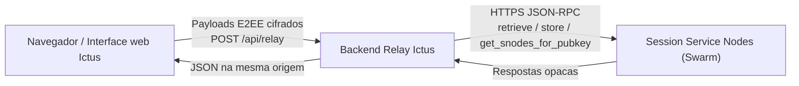

# Ictus Messenger

**Cliente web leve, auto-hospedável e zero-knowledge para a rede Session**

[](./LICENSE)
[](https://www.gnu.org/licenses/gpl-3.0)
[](https://nodejs.org/)
[](https://www.typescriptlang.org/)
[](https://react.dev/)
[](https://vite.dev/)
[](https://libsodium.gitbook.io/)
[](https://expressjs.com/)
[](https://docs.npmjs.com/cli/v10/using-npm/workspaces)
[](https://pm2.keymetrics.io/)
[](https://www.docker.com/)

O Ictus Messenger é um cliente web independente, rápido e **auto-hospedável** (*self-hosted*) para a rede de mensagens descentralizada [Session](https://getsession.org/). Chaves criptográficas e o texto claro das mensagens **nunca saem do navegador**: a decifragem ocorre estritamente no cliente. O backend atua como um **relay cego** — termina TLS/CORS e encaminha JSON-RPC aos Service Nodes da Session, **sem reter histórico de conversas nem logs de acesso**.

O repositório é um **monorepo** com **NPM Workspaces**: `frontend/` (React/Vite) e `backend/` (Express), orquestrados a partir da raiz com scripts unificados, PM2 e Docker opcional.

---

## Isenção de responsabilidade

O Ictus Messenger é uma **iniciativa independente e de código aberto da comunidade**. **Não** possui afiliação, endosso ou vínculo oficial com a Session Technology Foundation, a Oxen ou os aplicativos oficiais Session para desktop/mobile. Session® e marcas relacionadas pertencem aos seus respectivos titulares. O uso é por sua conta e risco; revise a criptografia e o modelo de ameaças antes de confiar neste cliente para comunicações sensíveis.

---

## Sumário

- [Arquitetura](#arquitetura)
- [Recursos e funcionalidades](#recursos-e-funcionalidades)
- [Stack tecnológica](#stack-tecnológica)
- [Estrutura do repositório (Monorepo)](#estrutura-do-repositório-monorepo)
- [Como executar](#como-executar)
  - [Opção A — Nativo (NPM Workspaces + PM2)](#opção-a--nativo-npm-workspaces--pm2)
  - [Opção B — Docker](#opção-b--docker)
- [Notas de segurança](#notas-de-segurança)
- [Contribuições](#contribuições)
- [Licença](#licença)

---

## Arquitetura

### Fluxo de dados

```text
┌─────────────────────────────┐     apenas ciphertext E2EE           ┌──────────────────────────────┐
│  Navegador / UI Ictus       │ ───────────────────────────────────► │  Relay Ictus (Express)       │
│  • Libsodium (WASM)         │         POST /api/relay              │  • Terminação CORS / TLS     │
│  • Identidade BIP-39        │ ◄─────────────────────────────────── │  • Allowlist anti-SSRF       │
│  • Cofre IndexedDB (PIN)    │         JSON-RPC opaco dos SNodes    │  • Sem banco de mensagens    │
└─────────────────────────────┘                                      └──────────────┬───────────────┘
                                                                                    │
                                                                                    │ HTTPS upstream
                                                                                    ▼
                                                                       ┌──────────────────────────────┐
                                                                       │  Session Service Nodes       │
                                                                       │  (swarm / seeds)             │
                                                                       │  retrieve · store · snodes   │
                                                                       └──────────────────────────────┘
```



### Componentes

| Componente | Função |
| --- | --- |
| **Motor criptográfico** | Pares Ed25519 determinísticos via Libsodium (`crypto_sign_seed_keypair`), derivados da entropia BIP-39; conversão Curve25519 para envelopes selados (`crypto_box_seal` + `crypto_secretbox_easy`). |
| **Identificador canônico** | Session ID = `05` + 64 caracteres hexadecimais (chave pública Ed25519) — **66 caracteres** no total. |
| **Backend de serviço único** | Gateway Bridge Express na porta **3001**, expondo `/api/relay`. Em desenvolvimento, o Vite faz proxy de `/api` → relay. Em produção, o mesmo processo Node serve o SPA estático (`frontend/dist`) e a API na mesma origem. |
| **Interação com o swarm** | RPCs de armazenamento assinadas pelo cliente, como `retrieve`, `store` e `get_snodes_for_pubkey`. O navegador **nunca** diala SNodes diretamente; cada URL upstream vai embutida como `targetUrl` dentro de `/api/relay` e é validada no servidor. |

**Postura zero-knowledge:** o relay não decifra envelopes, não armazena corpos de mensagem e não guarda chaves privadas de identidade. O cofre local (seed + ciphertext das conversas) permanece no IndexedDB do usuário, selado sob uma chave derivada do PIN.

### Monorepo (NPM Workspaces)

```text
                    ┌─────────────────────────────────────┐
                    │           Raiz (workspaces)         │
                    │  package.json · lockfile · Docker   │
                    │  scripts: dev · build · start · pm2 │
                    └──────────────┬──────────────────────┘
                                   │
                 ┌─────────────────┴─────────────────┐
                 ▼                                   ▼
    ┌────────────────────────┐          ┌────────────────────────┐
    │  frontend/             │          │  backend/              │
    │  React · Vite · WASM   │          │  Express · relay       │
    │  IndexedDB · i18n      │          │  serve SPA em prod     │
    └────────────────────────┘          └────────────────────────┘
```

| Pacote | Papel |
| --- | --- |
| **Raiz** | Orquestração: instalação única, scripts globais, `concurrently`, PM2 e Dockerfile |
| **`/frontend`** | App React/TypeScript/Vite (UI, criptografia no cliente, IndexedDB) |
| **`/backend`** | Servidor Express/TypeScript: relay JSON-RPC e, em produção, arquivos estáticos de `frontend/dist` |

**Vantagens da raiz unificada:** instalação única (`npm install`), builds encadeados (`npm run build`) e execução paralela em desenvolvimento (`npm run dev` via `concurrently`).

---

## Recursos e funcionalidades

### Identidade mnemônica e recuperação

- Frase de recuperação BIP-39 de **12 palavras** em inglês (128 bits de entropia) via `@scure/bip39`.
- Assistente guiado de criação de conta em **4 etapas**:
  1. Visualização única da frase + aviso crítico de segurança  
  2. Download preventivo do backup `.txt` (Session ID + palavras + instruções)  
  3. Verificação estrita na ordem correta (chips embaralhados ou digitação)  
  4. Definição do PIN local, selagem do cofre e entrada no chat  
- Recuperação total da identidade em outro navegador/dispositivo ao reinscrever a seed de 12 palavras.

### Cofre local com PIN

- Derivação KDF Argon2id: Libsodium `crypto_pwhash` (limites *moderate*) → chave simétrica de 32 bytes.
- Seed cifrada com `crypto_secretbox_easy` (ChaCha20-Poly1305); apenas ciphertext + salt persistem no IndexedDB.
- Conversas/mensagens armazenadas cifradas sob a mesma chave de cofre.
- **Esqueceu o PIN?** Recupere com a frase de 12 palavras e defina um novo PIN (sobrescreve o cofre local).
- Limpeza opcional: “Criar uma nova conta do zero” apaga `localStorage` / IndexedDB.

### Internacionalização (i18n)

| Idioma | Código | Observações |
| --- | --- | --- |
| Português | `pt` | Locale amigável por padrão |
| Inglês | `en` | |
| Espanhol | `es` | |
| Árabe | `ar` | `dir="rtl"` dinâmico + CSS lógico (`margin-inline`, `text-align: start`) |

Baseado em `i18next` + `react-i18next`, com detecção de idioma do navegador e seletor na interface.

### Segurança defensiva e hardening

- **XSS:** sanitização com DOMPurify antes de renderizar conteúdo de mensagem não confiável.
- **SSRF (relay):** `validateTargetUrl` bloqueia RFC 1918, loopbacks, link-local e endpoints de metadados de instância (`169.254.169.254` e hostnames equivalentes). Somente sufixos HTTPS de RPC da Session são permitidos.
- **Validação de esquemas:** Zod para envelopes de cofre/backup; regex estrito de Session ID (`05` + 64 hex).
- **Modo zero logs:** o frontend de produção remove `console.*`; o backend suprime ruído de transporte / `ECONNREFUSED` em direção aos SNodes, mantendo sinais reais de falha quando necessário.
- Cabeçalhos de segurança do navegador / CSP ajustados para Libsodium WASM e `connect-src` restrito à mesma origem.

---

## Stack tecnológica

| Camada | Tecnologias |
| --- | --- |
| **Frontend** | React 19, TypeScript, Vite 8, `libsodium-wrappers-sumo`, `@scure/bip39`, `i18next` / `react-i18next`, DOMPurify, Zod, Lucide React, `idb`, CSS próprio (Plus Jakarta Sans) — **sem Tailwind** |
| **Backend** | Node.js **≥ 20.x**, Express 5, `axios`, `ip-address`, `dotenv`, agente HTTPS customizado para SNodes upstream |
| **Monorepo / runtime** | NPM Workspaces, `concurrently`, PM2, Docker multi-stage (**opcional**) |

---

## Estrutura do repositório (Monorepo)

```text
session-messenger/
├── package.json           # workspaces + scripts unificados (dev, build, PM2, Docker)
├── package-lock.json      # lockfile único
├── Dockerfile             # build multi-stage → imagem alpine enxuta
├── .dockerignore
├── frontend/              # Interface web Ictus (Vite + React)
│   ├── src/
│   │   ├── components/    # Auth, assistente de criação, UI de chat
│   │   ├── crypto/        # Identidade, mnemônico, cofre, envelopes
│   │   ├── network/       # Pool de SNodes + cliente /api/relay
│   │   ├── storage/       # Cofre e mensagens no IndexedDB
│   │   └── locales/       # pt / en / es / ar
│   └── vite.config.ts     # Proxy de dev /api → :3001
├── backend/               # Gateway Bridge cego da Session
│   ├── src/
│   │   ├── server.ts      # Relay + SPA estático em produção
│   │   ├── security/      # SSRF + transporte silencioso
│   │   └── session/       # Cliente HTTPS upstream
│   └── .env.example
└── README.md
```

---

## Como executar

**Pré-requisitos (Opção A):** Node.js ≥ 20.x, npm, Git.  
**Pré-requisitos (Opção B):** Docker Engine.

```bash
git clone https://github.com/devs-cassiano/ictus-messenger.git
cd session-messenger
```

---

### Opção A — Nativo (NPM Workspaces + PM2)

Todos os comandos abaixo rodam na **raiz** do monorepo.

#### Instalação

```bash
npm install
cp backend/.env.example backend/.env
# Edite backend/.env se necessário (PORT=3001, USE_EXTERNAL_NODES=true)
```

Uma única `npm install` resolve dependências de `frontend/` e `backend/` (hoisting + lockfile compartilhado).

#### Scripts unificados

| Script | Descrição |
| --- | --- |
| `npm run dev` | Backend e frontend em paralelo (modo watch) via `concurrently` |
| `npm run build` | Compila sequencialmente os dois workspaces → pastas `dist` |
| `npm start` | Inicia o servidor compilado com Node (`backend/dist/server.js`) |
| `npm run start:prod` | Sobe a aplicação em segundo plano com **PM2** (`ictus-messenger`) |
| `npm run restart:prod` | Reinicia o processo no PM2 |
| `npm run stop:prod` | Interrompe o processo no PM2 |

#### Desenvolvimento

```bash
npm run dev
```

| Serviço | URL padrão |
| --- | --- |
| Frontend (Vite) | http://localhost:5173 |
| Backend (relay) | http://127.0.0.1:3001 |

O Vite faz proxy de `/api/*` → `http://127.0.0.1:3001`, mantendo mesma origem no navegador.

#### Produção no host

```bash
npm run build
npm start                 # foreground (Node)
# — ou —
npm run start:prod        # background (PM2)
npm run restart:prod
npm run stop:prod
```

Em produção o Express serve o SPA de `frontend/dist` e a API `/api/*` na mesma origem (porta **3001** por padrão).

Exemplo de `backend/.env`:

```bash
NODE_ENV=production
PORT=3001
USE_EXTERNAL_NODES=true
# CORS_ORIGINS=https://seu-dominio.exemplo
```

```text
Cliente ──► Express (:3001)
              ├─ /api/*  → relay Session
              └─ /*      → frontend/dist (SPA)
```

---

### Opção B — Docker

Imagem multi-stage opcional; o fluxo nativo (NPM / PM2) permanece disponível.

#### Build multi-stage

```text
┌──────────────────────────────┐
│  Stage 1 — builder           │
│  node:20-alpine              │
│  npm install + npm run build │
│  → frontend/dist             │
│  → backend/dist              │
└──────────────┬───────────────┘
               │ COPY artifacts
               ▼
┌──────────────────────────────┐
│  Stage 2 — runner            │
│  node:20-alpine (enxuta)     │
│  deps prod do backend        │
│  CMD node backend/dist/…     │
│  EXPOSE 3001                 │
└──────────────────────────────┘
```

O layout no container espelha o monorepo, para que o caminho `…/frontend/dist` resolvido pelo backend seja idêntico ao do host.

#### Comandos

| Ação | Docker | Atalho NPM |
| --- | --- | --- |
| Build da imagem | `docker build -t ictus-messenger .` | `npm run docker:build` |
| Execução | `docker run -d --name ictus-messenger -p 3001:3001 --restart unless-stopped ictus-messenger` | `npm run docker:run` |
| Logs | `docker logs -f ictus-messenger` | `npm run docker:logs` |
| Parada / remoção | `docker stop ictus-messenger && docker rm ictus-messenger` | `npm run docker:stop` |

```bash
# Build
npm run docker:build
# ou: docker build -t ictus-messenger .

# Run (detach, porta 3001, restart unless-stopped)
npm run docker:run
# ou: docker run -d --name ictus-messenger -p 3001:3001 --restart unless-stopped ictus-messenger

# Logs
npm run docker:logs
# ou: docker logs -f ictus-messenger

# Stop + remove
npm run docker:stop
# ou: docker stop ictus-messenger && docker rm ictus-messenger
```

> O script `npm run docker:run` publica a porta em `127.0.0.1:3001` (bind local). Para expor em todas as interfaces, use `docker run … -p 3001:3001`.

---

### Mapa rápido

| Objetivo | Comando |
| --- | --- |
| Dev (watch) | `npm run dev` |
| Build | `npm run build` |
| Start (Node) | `npm start` |
| Start (PM2) | `npm run start:prod` |
| Docker build → run | `npm run docker:build` → `npm run docker:run` |

---

## Notas de segurança

| Preocupação | Mitigação no Ictus |
| --- | --- |
| Chaves privadas no servidor | Nunca armazenadas; identidade derivada no navegador a partir do mnemônico |
| Ataque offline ao PIN | Argon2id *moderate* (`crypto_pwhash`) + salt aleatório por cofre |
| XSS via conteúdo de mensagem | DOMPurify + renderização React cuidadosa |
| SSRF via relay | Política de hostname/IP; bloqueio de faixas privadas e de metadados |
| Fetch acidental a SNode no navegador | CSP `connect-src 'self'`; todo upstream via `/api/relay` |
| Cofres legados / inconsistentes | Boot exige ciphertext mnemônico selado; linhas incompatíveis são purgadas |

**Recomendações operacionais**

- Prefira HTTPS em toda a produção (termine TLS à frente do processo Node ou do container, conforme sua topologia).
- Mantenha o SO e o Node atualizados.
- Trate arquivos `.txt` de recuperação baixados como material de **tomada total da conta** — guarde offline.
- Fluxos de pânico / logout zeram material sensível em memória e podem destruir o cofre local.

---

## Contribuições

Contribuições da comunidade são bem-vindas:

- Auditorias de segurança e divulgação responsável
- Novos idiomas / polimento de i18n
- Refinamentos de UI/UX que preservem o modelo *privacy-first*
- Hardening do relay e da documentação de deploy

Fluxo sugerido:

1. Faça um *fork* do repositório e crie uma *branch* de feature.
2. Mantenha TypeScript estrito (`npx tsc --noEmit` no workspace `frontend`).
3. Não introduza `crypto` / `Buffer` do Node no `frontend/` — use Libsodium + `Uint8Array`.
4. Abra um *pull request* com nota clara de modelo de ameaças ao alterar criptografia ou `/api/relay`.

---

## ☕ Apoie o Projeto / Donate

O Ictus Messenger é um projeto **open-source independente**, focado em **privacidade estrita**, anonimato e modelo **zero-knowledge**. Se o projeto for útil para você, considere apoiá-lo com uma doação em criptomoeda — 100% voluntária e sem rastreadores.

| Criptomoeda | Rede | Endereço da Carteira |
| :--- | :--- | :--- |
| **Bitcoin (BTC)** | Bitcoin Mainnet | `bc1qdmfeatvcd6w43d6ld7jda8ypw2dez224yul6fr` |
| **Ethereum (ETH)** | Ethereum (ERC-20) | `0xFc99D8DEF31dB48EF05a01233e85547E47D18F9C` |
| **Tether (USDT)** | **TRON (TRC-20)** | `TXMJdx8vGmAYhDUUwH1zKDoZP3j3DG5PDW` |

> ⚠️ **Atenção:** Certifique-se de selecionar a **rede correta** ao realizar transferências, especialmente para **USDT (rede TRON / TRC-20)**, prevenindo a perda irreversível de fundos.

---

## Licença

Este projeto é destinado à distribuição open source sob a **Licença MIT** (veja [`LICENSE`](./LICENSE) quando presente no repositório). Alguns badges acima também referenciam **GPLv3** para ecossistemas que preferem *copyleft*; se houver política de licença dual, os arquivos `LICENSE` / `COPYING` são a fonte autoritativa.

O `package.json` do backend pode ainda listar um identificador SPDX provisório até a finalização do arquivo de licença na raiz — trate o `LICENSE` da raiz como a fonte da verdade do monorepo.

---

## Agradecimentos

- Rede [Session](https://getsession.org/) / Oxen pelo desenho de mensagens descentralizadas
- [libsodium](https://libsodium.gitbook.io/) e [libsodium.js](https://github.com/jedisct1/libsodium.js)
- [@scure/bip39](https://github.com/paulmillr/scure-bip39) pelas utilidades BIP-39 auditadas

---

<p align="center">
  <strong>Ictus Messenger</strong> — Session na web, auto-hospedável e zero-knowledge.<br/>
  <em>Chaves no navegador. O relay permanece cego.</em>
</p>
